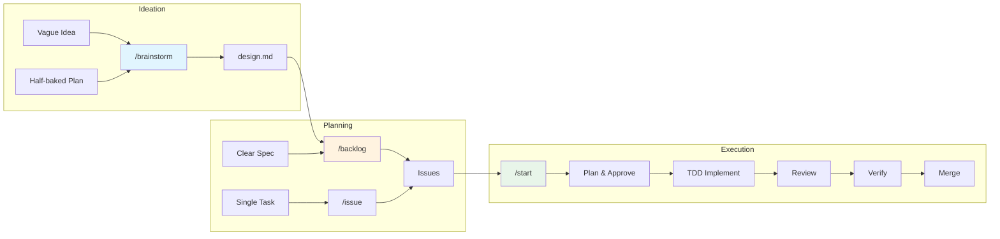

<p align="center">
  
</p>

# PASIV

> *"The PASIV device enables shared dreaming."*
>
> In Inception, the PASIV (Portable Automated Somnacin IntraVenous) device connects the team, enabling them to enter dreams together and extract what matters most. This tool does the same for your codebase - connecting your team of AI agents to extract working, tested, reviewed implementations from the seeds of ideas.

**Solo dev workflow: specs → issues → TDD implementation → review → merge.**

---

## The Team

Every extraction needs a team. PASIV connects them:

| Role | What They Do | In PASIV |
|------|--------------|----------|
| **Dreamer** | Explores possibilities, refines the vision | `/brainstorm` - Socratic design refinement |
| **Extractor** | Leads the operation, pulls value from the target | `/kick` - orchestrates the full flow |
| **Architect** | Designs the dream levels | `/backlog` - structures specs into issues |
| **Forger** | Transforms and adapts | `/issue`, `/parent` - shapes ideas into trackable work |
| **Point Man** | Handles the details | `git-ops`, `issue-ops`, `project-ops` - the helpers |
| **Chemist** | Enables deep dreaming | TDD, verification, systematic debugging - the methodology |

---

## Install

### CLI

```bash
# Add the marketplace
/plugin marketplace add inceptyon-labs/PASIV

# Install the plugin
/plugin install pasiv@pasiv
```

### TARS (Visual Plugin Manager)

Prefer a UI? Use [**TARS**](https://github.com/inceptyon-labs/TARS) - a visual plugin manager for Claude Code:

- Browse and install plugins from a curated library
- Automatic update notifications
- Easy enable/disable without uninstalling

<p align="center">
  <a href="https://github.com/inceptyon-labs/TARS">
    
  </a>
</p>

## Quick Start

```bash
# Refine a vague idea into a design
/brainstorm

# Stress-test an existing half-baked plan
/brainstorm rough-idea.md

# Parse a design/spec into issues
/backlog design.md

# Start working on an issue (full extraction)
/kick 42
```

## Issue Type Hierarchy

| Level | Type | Scope | Example |
|-------|------|-------|---------|
| **Epic** | Strategic | Multiple features, weeks/months | "User Authentication System" |
| **Feature** | Tactical | Single capability, days/week | "OAuth Login" |
| **Task** | Execution | Single work item, hours | "Create OAuth callback endpoint" |

Uses GitHub's native issue types (`--type Epic/Feature/Task`).

## Commands

| Command | Creates | Description |
|---------|---------|-------------|
| `/brainstorm` | Design doc | Socratic dialogue to refine ideas |
| `/brainstorm doc.md` | Design doc | Stress-test existing document |
| `/issue` | Task | Create single work item |
| `/parent` | Feature → Tasks | Create feature with task sub-issues |
| `/backlog` | Epic → Feature → Task | Parse spec into full hierarchy |
| `/kick` | - | Full implementation flow |
| `/s-review` | - | S (Sonnet) - trivial changes |
| `/o-review` | - | O (Opus) - simple features |
| `/sc-review` | - | SC (Sonnet → Codex) - moderate, budget |
| `/oc-review` | - | OC (Opus → Codex) - complex, quality |
| `/soc-review` | - | SOC (Sonnet → Opus → Codex) - security-critical |
| `/codex-review` | - | Standalone Codex review |

## Workflow Patterns

> *"An idea is like a virus. Resilient. Highly contagious."*

Choose your entry point based on what you have:

| You have... | Start with | Flow |
|-------------|------------|------|
| Vague idea | `/brainstorm` | → design.md → `/backlog` → `/kick` |
| Half-baked plan | `/brainstorm doc.md` | → refined design → `/backlog` → `/kick` |
| Clear requirements | `/backlog spec.md` | → issues → `/kick` |
| Single task | `/issue` | → `/kick 42` |
| Existing issue | `/kick 42` | (inline planning) |

## Flow Diagram



**Model delegation:**
- Simple ops (git, issue, project) → **Haiku** (cheap, forked context)
- Reviews → **Sonnet/Opus/Codex** (where quality matters)

## The `/brainstorm` Flow

> *"What's the most resilient parasite? An idea."*

Socratic design refinement - turn vague ideas into validated designs before writing code.

```
/brainstorm                  # Start from a vague idea
/brainstorm rough-plan.md    # Refine existing document
```

### Phases

| Phase | What Happens |
|-------|--------------|
| **1. Understand** | Read existing doc OR ask "What are you building?" |
| **2. Socratic Dialogue** | One question at a time (5-10 questions) |
| **3. Explore Approaches** | Present 2-3 options with trade-offs |
| **4. Present Design** | 200-300 word chunks, validate each |
| **5. Document** | Save to `docs/designs/YYYY-MM-DD-feature.md` |
| **6. Next Steps** | Offer `/backlog`, `/parent`, or `/issue` |

### Question Types

- **Clarifying**: "Who will use this?" "What triggers this flow?"
- **Challenging**: "What if this fails?" "How does this scale?"
- **Scoping**: "Is X in scope?" "Can we defer Y?"

**Output:** Validated design document ready for `/backlog`

---

## The `/kick` Flow

> *"You mustn't be afraid to dream a little bigger, darling."*

```
/kick 42
```

1. **Fetch issue details** (reliable lookup by number)
2. **Check for sub-issues** (if parent, use autonomous flow)
3. Move to **In Progress**
4. Create plan → **select review depth** → wait for approval
5. **TDD implementation** (RED → GREEN → REFACTOR → COMMIT)
6. Run tests (systematic debugging if failures)
7. **Code review** (S/O/SC/OC/SOC based on selection)
8. **Verification gate** (fresh test/build/lint evidence)
9. Check off acceptance criteria
10. Merge to main, move to **Done**, close issue

### Review Tier Selection

During plan approval, select review tier with smart recommendations based on size and security:

| Tier | Models | When Recommended |
|------|--------|------------------|
| **S** | Sonnet | `size:XS`, trivial |
| **O** | Opus | `size:S`, simple features |
| **SC** | Sonnet → Codex | `size:M`, moderate |
| **OC** | Opus → Codex | `size:L`, complex |
| **SOC** | Sonnet → Opus → Codex | `size:XL`, security-critical |

### TDD Methodology

> *"The dreamer can always remember the genesis of the idea."*

All implementation follows test-driven development:

```
RED → GREEN → REFACTOR → COMMIT → repeat
```

1. **RED**: Write failing test
2. **GREEN**: Write minimal code to pass
3. **REFACTOR**: Clean up
4. **COMMIT**: After each cycle

**Iron Law**: No production code without a failing test first.

### Verification Gate

> *"What is the most resilient parasite? An idea."*

Before merge, fresh evidence is required:

| Check | Command |
|-------|---------|
| Tests pass | `npm test` with output |
| Build succeeds | `npm run build` with exit 0 |
| Lint clean | `npm run lint` with output |

No "should work" - actual runs with actual output.

### Epic & Feature Support (Autonomous)

> *"We need to go deeper."*

**Reviews always happen at the Task level** - Epics and Features are containers.

| `/kick` on | Behavior |
|-------------|----------|
| Task | Implement → Review → Merge |
| Feature | For each Task: Implement → Review → Merge |
| Epic | For each Feature → For each Task: Implement → Review → Merge |

When you `/kick` an **Epic**:

```
Epic #10: User Authentication System

├── Feature #11: Email/Password Login
│   ├── #14 Create user table        → S   (size:XS, area:db)
│   ├── #15 Create auth endpoint     → OC  (size:M) [security]
│   └── #16 Create login form        → SC  (size:M, area:frontend)
│
└── Feature #12: OAuth Login
    ├── #17 Add OAuth config         → SC  (size:S) [security]
    └── #18 Add OAuth callback       → OC  (size:M) [security]

Total: 5 Tasks across 2 Features
Approve and start autonomous run? [Yes/Customize/Cancel]
```

- **Approve once, walk away** - implements all Tasks autonomously
- **Stops only on error** - asks how to proceed
- **Auto-closes Features** when all their Tasks complete
- **Auto-closes Epic** when all Features complete

**Task priority order:**
- `area:db` → `area:infra` → `area:backend` → `area:frontend`
- Within same area: `priority:high` → `priority:medium` → `priority:low`

### Systematic Debugging

When tests fail, root cause analysis is enforced:

1. **Investigate** - Read full error, find root cause
2. **Hypothesize** - Form specific theory
3. **Test** - Make ONE minimal change
4. **Verify** - Run tests again

**Three Strikes Rule**: After 3 failed fix attempts, stop and reassess.

## Review Tiers

| Tier | Name | Models | Cost | When to Use |
|------|------|--------|------|-------------|
| 1 | S | Sonnet | $ | Typos, config, trivial fixes |
| 2 | O | Opus | $$ | Simple features, clear scope |
| 3 | SC | Sonnet → Codex | $$ | Moderate changes, budget-conscious |
| 4 | OC | Opus → Codex | $$$ | Complex features, quality focus |
| 5 | SOC | Sonnet → Opus → Codex | $$$$ | Security-critical, large refactors |

All multi-pass reviews are **cascading** - each pass reviews cumulative changes including previous fixes.

### Recommendation Matrix

| Size | Default | If Security Files Detected |
|------|---------|----------------------------|
| `size:XS` | S | O |
| `size:S` | O | SC |
| `size:M` | SC | OC |
| `size:L` | OC | SOC |
| `size:XL` | SOC | SOC |

**Security files**: `auth`, `crypto`, `payment`, `token`, `secret`, `password`, `session`, `oauth`, `jwt`, `key`, `credential`

## GitHub Projects Integration

Issues are **automatically added** to a GitHub Project board.

- **Auto-creates project** named after your repo (on first `/issue`, `/parent`, or `/backlog`)
- **Prompts if other projects exist** (choose existing or create new)
- **Status updates**: Issues move to In Progress/Done automatically
- **Prioritization**: `/backlog` outputs suggested implementation order

### Required Token Scope

```bash
gh auth refresh -s project
```

### Implementation Order

`/backlog` prioritizes issues by:
1. Layer: `area:db` → `area:infra` → `area:backend` → `area:frontend`
2. Parent/sub-issue relationships
3. Explicit `Depends on #N` references

## Labels

| Category | Labels |
|----------|--------|
| Priority | `priority:high`, `priority:medium`, `priority:low` |
| Size | `size:XS` (<1h), `size:S` (1-4h), `size:M` (4-8h), `size:L` (8-16h), `size:XL` (16+h) |
| Area | `area:frontend`, `area:backend`, `area:infra`, `area:db` |

**Note:** Issue types (Epic, Feature, Task) use GitHub's native `--type` flag, not labels. Configure types in your organization's Settings → Planning → Issue types.

## Requirements

- **GitHub CLI** (`gh`) - https://cli.github.com
- **Codex CLI** - for Pass 3 reviews
- **jq** - for JSON parsing

## Setup for Your Repo

```bash
# Ensure token has project scope
gh auth refresh -s project

# Create labels (optional)
bash ~/.claude/plugins/PASIV/.github/scripts/create-labels.sh
```

## Model Optimization

Simple operations run on **Haiku** (cheap) in forked contexts to save tokens:

| Skill | Model | Operations |
|-------|-------|------------|
| `git-ops` | Haiku | branch, commit, push, merge |
| `issue-ops` | Haiku | create, close, check-off criteria |
| `project-ops` | Haiku | setup, add issue, move status |

Main skills (Sonnet/Opus) delegate to these helpers automatically.

## Plugin Structure

```
hooks/
├── hooks.json                  # SessionStart hook config
└── session-start.sh            # Injects skill awareness at session start

skills/
├── brainstorm/SKILL.md         # /brainstorm (Dreamer)
├── issue/SKILL.md              # /issue (Forger)
├── parent/SKILL.md             # /parent (Forger)
├── kick/SKILL.md               # /kick (Extractor)
├── backlog/SKILL.md            # /backlog (Architect)
│
├── s-review/SKILL.md           # /s-review (Sonnet)
├── o-review/SKILL.md           # /o-review (Opus)
├── sc-review/SKILL.md          # /sc-review (Sonnet → Codex)
├── oc-review/SKILL.md          # /oc-review (Opus → Codex)
├── soc-review/SKILL.md         # /soc-review (Sonnet → Opus → Codex)
├── codex-review/SKILL.md       # /codex-review (standalone)
│
├── using-pasiv/SKILL.md        # Skill awareness (injected at session start)
├── tdd/SKILL.md                # TDD methodology (Chemist)
├── verification/SKILL.md       # Verification gate (Chemist)
├── systematic-debugging/SKILL.md # Debug methodology (Chemist)
│
├── git-ops/SKILL.md            # Helper (Point Man)
├── issue-ops/SKILL.md          # Helper (Point Man)
└── project-ops/SKILL.md        # Helper (Point Man)

docs/
├── designs/                    # Design documents from /brainstorm
└── plans/                      # Implementation plans

.github/
├── scripts/
│   ├── install.sh
│   └── create-labels.sh
└── workflows/
    └── version-bump.yml        # Auto-bump version on push
```

## Session-Start Hook (Context Efficiency)

PASIV uses a session-start hook to make Claude aware of available skills without bloating context.

**How it works:**

| When | What Loads | Size |
|------|------------|------|
| Session start | `using-pasiv/SKILL.md` (skill index/guide) | ~100 lines |
| You run `/kick` | `start/SKILL.md` (full instructions) | On-demand |
| You run `/codex-review` | `codex-review/SKILL.md` (full instructions) | On-demand |

The session-start hook (`hooks/session-start.sh`) injects only the lightweight skill awareness guide. This tells Claude:
- What skills exist (`/brainstorm`, `/kick`, `/issue`, etc.)
- When to use each one
- Workflow patterns and decision flow

**The actual skill content is loaded lazily** - only when you invoke a skill does its full instructions enter context.

This means you get skill-aware behavior from the first message without paying the context cost of loading every skill upfront.

## Updating

```bash
rm -rf ~/.claude/plugins/cache
claude plugin update PASIV
```

## Acknowledgments

- Development methodology (TDD cycle, verification gates, systematic debugging) and brainstorming flow inspired by [obra/superpowers](https://github.com/obra/superpowers)
- Name and lore inspired by Christopher Nolan's *Inception* (2010)

---

> *"Do you want to take a leap of faith? Or become an old man, filled with regret, waiting to die alone?"*
>
> Connect to PASIV. `/kick next`
