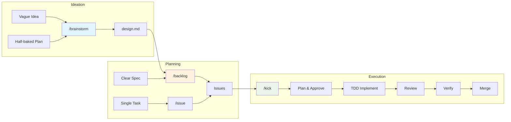

<p align="center">
  
</p>

# PASIV

> *"The PASIV device enables shared dreaming."*
>
> In Inception, the PASIV (Portable Automated Somnacin IntraVenous) device connects the team, enabling them to enter dreams together and extract what matters most. This tool does the same for your codebase - connecting your team of AI agents to extract working, tested, reviewed implementations from the seeds of ideas.

**Solo dev workflow: specs → issues → TDD implementation → review → merge.**

---

## The Team

Every extraction needs a team. PASIV connects them:

| Role | What They Do | In PASIV |
|------|--------------|----------|
| **Dreamer** | Explores possibilities, refines the vision | `/brainstorm` - Socratic design refinement |
| **Extractor** | Leads the operation, pulls value from the target | `/kick` - orchestrates the full flow |
| **Architect** | Designs the dream levels | `/backlog` - structures specs into issues |
| **Forger** | Transforms and adapts | `/issue`, `/parent` - shapes ideas into trackable work |
| **Point Man** | Handles the details | `task-ops`, `git-ops`, `project-ops` - the helpers |
| **Chemist** | Enables deep dreaming | TDD, verification, systematic debugging - the methodology |
| **Fischer** | Carries context between dreams | `/handoff` - structured session memory |

---

## Install

### CLI

```bash
# Add the marketplace
/plugin marketplace add inceptyon-labs/PASIV

# Install the plugin
/plugin install pasiv@pasiv
```

### TARS (Visual Plugin Manager)

Prefer a UI? Use [**TARS**](https://github.com/inceptyon-labs/TARS) - a visual plugin manager for Claude Code:

- Browse and install plugins from a curated library
- Automatic update notifications
- Easy enable/disable without uninstalling

<p align="center">
  <a href="https://github.com/inceptyon-labs/TARS">
    
  </a>
</p>

## Quick Start

```bash
# Initialize PASIV in your project (interactive setup)
/pasiv init

# Refine a vague idea into a design
/brainstorm

# Stress-test an existing half-baked plan
/brainstorm rough-idea.md

# Parse a design/spec into issues
/backlog design.md

# Start working on an issue (full extraction)
/kick 42

# Work on the highest priority task
/kick next

# Save session context before ending
/handoff
```

## Setup

> *"You need the simplest version of the idea."*

Run `/pasiv init` to configure PASIV for your project. The interactive wizard:

1. **Chooses your task backend** — GitHub Issues, Beans, or local markdown
2. **Configures project board** (GitHub) or hooks (Beans)
3. **Creates project directories** — `docs/handoffs/`, `docs/designs/`, `docs/plans/`, `docs/scans/`
4. **Writes `.pasiv.yml`** — your backend configuration
5. **Appends PASIV rules to `CLAUDE.md`** — session start behavior, rules, directory map
6. **Optionally initializes design system** — for frontend projects

### Task Backends

PASIV supports pluggable task backends. Choose the one that fits your workflow:

| Backend | Best For | Storage | Dependencies |
|---------|----------|---------|--------------|
| **GitHub Issues** | Team collaboration, CI integration | GitHub API | `gh` CLI |
| **Beans** | Solo devs, agent-native, version-controlled | `.beans/` flat files | `beans` CLI |
| **Local Markdown** | Zero dependencies, simple projects | `docs/tasks/` files | None |

No `.pasiv.yml` defaults to Local Markdown (zero-dependency). GitHub and Beans are opt-in via `/pasiv init` or `.pasiv.yml`.

## Issue Type Hierarchy

| Level | Type | Scope | Example |
|-------|------|-------|---------|
| **Epic** | Strategic | Multiple features, weeks/months | "User Authentication System" |
| **Feature** | Tactical | Single capability, days/week | "OAuth Login" |
| **Task** | Execution | Single work item, hours | "Create OAuth callback endpoint" |

## Commands

| Command | Creates | Description |
|---------|---------|-------------|
| `/pasiv init` | Config | Interactive setup wizard |
| `/brainstorm` | Design doc | Socratic dialogue to refine ideas |
| `/brainstorm doc.md` | Design doc | Stress-test existing document |
| `/issue` | Task | Create single work item |
| `/parent` | Feature → Tasks | Create feature with task sub-issues |
| `/backlog` | Epic → Feature → Task | Parse spec into full hierarchy |
| `/kick 42` | - | Full implementation flow for a specific task |
| `/kick next` | - | Work on highest priority ready task |
| `/handoff` | Handoff doc | Save session context for next session |
| `/reflect` | Memory / feedback | Persist durable facts, corrections, and reusable workflows from the session |
| `/repo-scan` | Report | Security scan for vulnerabilities, malware, secrets |
| `/review [profile]` | - | Review the diff at a depth — `quick`/`standard`/`deep`/`codex` |

## Workflow Patterns

> *"An idea is like a virus. Resilient. Highly contagious."*

Choose your entry point based on what you have:

| You have... | Start with | Flow |
|-------------|------------|------|
| Vague idea | `/brainstorm` | → design.md → `/backlog` → `/kick` |
| Half-baked plan | `/brainstorm doc.md` | → refined design → `/backlog` → `/kick` |
| Clear requirements | `/backlog spec.md` | → issues → `/kick` |
| Single task | `/issue` | → `/kick 42` |
| Existing issue | `/kick 42` | (inline planning) |
| Forked/cloned repo | `/repo-scan` | → security report |
| New project | `/pasiv init` | → configured and ready |
| End of session | `/handoff` | → context preserved |

## Flow Diagram


```mermaid
flowchart LR
    subgraph Ideation
        A[Vague Idea] --> B["#47;brainstorm"]
        C[Half-baked Plan] --> B
        B --> D[design.md]
    end

    subgraph Planning
        D --> E["#47;backlog"]
        F[Clear Spec] --> E
        E --> G[Issues]
        H[Single Task] --> I["#47;issue"]
        I --> G
    end

    subgraph Execution
        G --> J["#47;kick"]
        J --> K[Plan & Approve]
        K --> L[TDD Implement]
        L --> M[Review]
        M --> N[Verify]
        N --> O[Merge]
    end

    style B fill:#e1f5fe
    style E fill:#fff3e0
    style J fill:#e8f5e9
```

---

## The `/brainstorm` Flow

> *"What's the most resilient parasite? An idea."*

Socratic design refinement - turn vague ideas into validated designs before writing code.

```
/brainstorm                  # Start from a vague idea
/brainstorm rough-plan.md    # Refine existing document
```

### Phases

| Phase | What Happens |
|-------|--------------|
| **1. Understand** | Read existing doc OR ask "What are you building?" |
| **2. Socratic Dialogue** | One question at a time (5-10 questions) |
| **3. Explore Approaches** | Present 2-3 options with trade-offs |
| **4. Present Design** | 200-300 word chunks, validate each |
| **5. Document** | Save to `docs/designs/YYYY-MM-DD-feature.md` |
| **6. Next Steps** | Offer `/backlog`, `/parent`, or `/issue` |

### Question Types

- **Clarifying**: "Who will use this?" "What triggers this flow?"
- **Challenging**: "What if this fails?" "How does this scale?"
- **Scoping**: "Is X in scope?" "Can we defer Y?"

**Output:** Validated design document ready for `/backlog`

---

## The `/kick` Flow

> *"You mustn't be afraid to dream a little bigger, darling."*

```
/kick 42            # By issue number (GitHub) or bean ID (Beans)
/kick lensing-gc5o  # Beans bean ID
/kick task-001      # Local task ID
/kick next          # Highest priority ready task
```

1. **Detect backend** (read `.pasiv.yml`)
2. **Load session handoff** (if one exists in `docs/handoffs/`)
3. **Fetch task details** via `task-ops`
4. **Check for sub-issues** (if parent, use autonomous flow)
5. **Baseline test run** (Haiku runs tests — ensures clean baseline)
6. Move to **In Progress**
7. **Load design system** (if `area:frontend` or `area:mobile`)
8. Create plan → **select review depth** → wait for approval
9. **Implementation** (Opus writes RED tests in-context; a fresh Sonnet implementer subagent does GREEN — keeps the coordinator lean)
10. Run tests (systematic debugging if failures)
11. **Code review** (review profile, based on selection)
12. **Verification gate** (Haiku fixes simple issues, escalates complex to Opus)
13. Check off acceptance criteria
14. **Write handoff** (if parent issue with remaining tasks)
15. Merge to main, move to **Done**, close task

### Review Profile Selection

During plan approval, select a review profile with smart recommendations based on size and security:

| Profile | Passes | When Recommended |
|---------|--------|------------------|
| `quick` | Sonnet | `size:XS`/`size:S`, trivial |
| `standard` | Opus → Codex | most changes (default) |
| `deep` | Opus → Codex → Opus | `size:L`/`size:XL`, security-critical — final pass re-checks cumulative fixes |

Configurable in `.pasiv.yml`. See `docs/reference/review-profiles.md`.

### Split-Model TDD

> *"The dreamer can always remember the genesis of the idea."*

PASIV enforces split-model TDD — the stronger model writes the spec, the cheaper model writes the code:

```
RED (Opus) → GREEN (Sonnet) → REFACTOR (Sonnet) → COMMIT → repeat
```

| Phase | Model | Why |
|-------|-------|-----|
| **RED** (write test) | Opus | Tests ARE the specification. Stronger model writes better specs. |
| **GREEN** (write code) | Sonnet | Code is constrained by the test. Cheaper model follows the spec. |
| **REFACTOR** | Sonnet | Clean up while tests stay green. |

This is enforced by context isolation: the `execute` coordinator (Opus) writes the RED tests in-context, then dispatches a fresh Sonnet implementer subagent for GREEN/REFACTOR/COMMIT. The noisy edit-test-iterate loop runs in the subagent's window, so the coordinator stays lean (standard 200k) and the Sonnet workers stay on subscription.

### Baseline Test Run

> *"Every dream has a foundation."*

Before starting work on any issue, PASIV runs the test suite to establish a clean baseline:

- **Haiku runs tests** and reports results
- **If tests pass**: Continue with implementation
- **If tests fail**: Ask user how to proceed (fix first, proceed anyway, or cancel)

This ensures you're not blamed for pre-existing test failures.

### Verification Gate

Before merge, fresh evidence is required with **smart escalation**:

**Haiku handles:**
- Running all checks (tests, build, lint, typecheck)
- Simple fixes (syntax errors, missing imports, lint auto-fixes)
- Max 2 simple fix attempts per check

**Escalates to Opus when:**
- Simple fixes don't work after 2 attempts
- Logic errors detected
- Complex debugging needed

**The gate loops until all checks pass** — no "should work" claims.

| Check | How It Works |
|-------|--------------|
| Tests | Haiku runs → tries simple fixes → escalates to Opus if needed |
| Build | Same strategy - simple first, escalate if complex |
| Lint | Haiku auto-fixes (usually works) |
| TypeCheck | Simple types first, escalate if complex |
| Smoke | Opt-in: runs `verify.command` from `.pasiv.yml` if configured |

**UI verification (opt-in):** with `workflow.ui_verify: true`, frontend/mobile tasks get driven in the running app — launch, exercise the change, screenshot — before the gate. Enable per project in `/pasiv init`.

### Epic & Feature Support (Autonomous)

> *"We need to go deeper."*

**Reviews always happen at the Task level** — Epics and Features are containers.

| `/kick` on | Behavior |
|-------------|----------|
| Task | Implement → Review → Merge |
| Feature | For each Task: Implement → Review → Merge |
| Epic | For each Feature → For each Task: Implement → Review → Merge |

When you `/kick` an **Epic**:

```
Epic: User Authentication System

├── Feature: Email/Password Login
│   ├── Create user table        → quick     (size:XS, area:db)
│   ├── Create auth endpoint     → deep      (size:M) [security]
│   └── Create login form        → standard  (size:M, area:frontend)
│
└── Feature: OAuth Login
    ├── Add OAuth config         → standard  (size:S) [security]
    └── Add OAuth callback       → deep      (size:M) [security]

Total: 5 Tasks across 2 Features
Approve and start autonomous run? [Yes/Customize/Cancel]
```

- **Approve once, walk away** — implements all Tasks autonomously
- **Stops only on error** — asks how to proceed
- **Auto-closes Features** when all their Tasks complete
- **Auto-closes Epic** when all Features complete
- **Writes handoffs** between tasks to preserve context

**Task priority order:**
- `area:db` → `area:infra` → `area:backend` → `area:frontend`
- Within same area: `priority:high` → `priority:medium` → `priority:low`

### Systematic Debugging

When tests fail, root cause analysis is enforced:

1. **Investigate** — Read full error, find root cause
2. **Hypothesize** — Form specific theory
3. **Test** — Make ONE minimal change
4. **Verify** — Run tests again

**Three Strikes Rule**: After 3 failed fix attempts, stop and reassess.

---

## Session Handoffs

> *"An idea is like a virus. Resilient. Highly contagious. And even the smallest seed of an idea can grow."*

PASIV preserves session context through structured handoff files, inspired by the [Claude Context OS](https://github.com/Arkya-AI/claude-context-os) pattern.

```
/handoff                    # Write handoff before ending session
```

### When Handoffs Happen

| Trigger | What Happens |
|---------|--------------|
| You run `/handoff` | Write session state to `docs/handoffs/` |
| Context compaction | PreCompact hook reminds you to write handoff |
| Parent issue mid-flow | `/kick` auto-writes handoff between tasks |
| Next session start | `/kick` loads latest handoff, archives it |

### What's Captured

- What was done (completed work)
- Exact numbers and metrics
- Decisions made (with rationale and alternatives considered)
- Open questions (UNCLEAR, ASSUMED, MISSING)
- Files changed and why
- What NOT to re-read
- Next steps and files to load

Handoffs live at `docs/handoffs/handoff-YYYY-MM-DD-{topic}.md` and are archived to `docs/handoffs/archive/` after loading.

---

## Security Scanning

> *"You're asking me for inception."*

```
/repo-scan                  # Scan current repo
/repo-scan ~/path/to/repo   # Scan a specific directory
```

Multi-ecosystem security scan that checks for:
- Dependency vulnerabilities (CVEs)
- Suspicious install scripts
- Obfuscated or encoded code
- Network calls to unknown servers
- Malware patterns (miners, shells, exfiltration)
- Hardcoded secrets and credentials
- File system anomalies

Generates a report in `docs/scans/` with a verdict: **PASS**, **CAUTION**, or **FAIL**.

---

## Review Profiles

Reviews run as **profiles** — an ordered chain of passes resolved by the `review` skill:

| Profile | Passes | When |
|---------|--------|------|
| `none` | — | skip |
| `quick` | Sonnet | trivial |
| `standard` | Opus → Codex | most changes (default) |
| `deep` | Sonnet → Opus → Codex | security-critical / large |

Passes are **cascading** (each sees prior fixes) and **host-aware** — a Claude subagent or the Codex MCP under Claude Code; `claude -p` (Claude-as-reviewer) or native under a Codex host. Configurable in `.pasiv.yml`. Standalone: `/review [profile]`. Full rule, schema, and adapters: `docs/reference/review-profiles.md`.

---

## Design System Integration

PASIV integrates with [interface-design](https://github.com/Dammyjay93/interface-design) for consistent UI implementation.

**How it works:**
- When `/kick` processes an issue with `area:frontend` or `area:mobile` label, it automatically loads `.interface-design/system.md`
- The design system defines tokens (spacing, colors, typography) and patterns (buttons, cards, forms)
- Implementation must reference established tokens and follow documented patterns
- `/pasiv init` asks if your project has a frontend and offers to run `/interface-design:init`

**Setup (per project):**
```bash
# Initialize design system in your project
/interface-design:init
```

**Verification:**
```bash
# Audit code against design system
/interface-design:audit src/components
```

---

## Per-Project Configuration

`/pasiv init` writes two things to your project:

### `.pasiv.yml`

Task backend configuration:

```yaml
# GitHub
task_backend: github
github:
  project_board: true

# Beans
task_backend: beans
beans:
  path: .beans
  prefix: beans-

# Local (default)
task_backend: local
local:
  path: docs/tasks
```

Workflow toggles and verification extras (written by `/pasiv init`):

```yaml
workflow:
  plan_approval: true
  tdd: true
  review: true
  verification: true
  ui_verify: false      # opt-in: drive the app + screenshot for UI tasks before merge

verify:
  command: "npm run smoke"   # optional: extra gate command, must exit 0
```

### `CLAUDE.md` (PASIV section)

Operational behavior appended to your project's `CLAUDE.md`:

- **Session Start** — Load latest handoff, state understanding before starting
- **Rules** — Use PASIV skills, write state to disk, TDD enforced, verification gate
- **Where Things Live** — Directory map for handoffs, designs, plans, scans

This keeps PASIV context per-project. Projects without the PASIV section in `CLAUDE.md` are unaffected.

---

## Model Optimization

> *"I bought the airline."*

The flow runs on **Opus** as a lean coordinator that dispatches **Sonnet** subagents for the heavy work; helper operations run on **Haiku** in forked contexts:

| Skill | Model | Operations |
|-------|-------|------------|
| `kick` | Opus | orchestrator/router — setup + sequence the flow |
| `plan` | Opus | plan + native tasks (writing-plans rigor, ladder, gap check) |
| `execute` | Opus (coord) | writes RED in-context; dispatches a Sonnet implementer subagent for GREEN |
| `review` | Opus (coord) | per-pass reviewer-subagent / codex dispatch by profile |
| `finish` | Opus | completion summary, handoff, merge, close |
| `git-ops` | Haiku | branch, commit, push, merge |
| `task-ops` | Haiku | route to backend (issue-ops, beans-ops, local-ops) |
| `issue-ops` | Haiku | GitHub issue CRUD |
| `beans-ops` | Haiku | Beans flat-file CRUD |
| `local-ops` | Haiku | Local markdown CRUD |
| `project-ops` | Haiku | GitHub Project board operations |
| `test-runner` | Haiku | run tests, parse results, report |
| `handoff-ops` | Haiku | read/archive handoff files |
| `verification` | Haiku → Opus | simple fixes (Haiku), complex debugging (Opus) |

**Split-model TDD**: the `execute` coordinator (Opus) writes RED tests; a fresh Sonnet implementer subagent does GREEN in an isolated context — so the whole session stays in standard 200k.

**Optional tier routing**: `plan` tags tasks `mechanical`/`standard`/`frontier`; map them to per-host models in `.pasiv.yml` `model_routing` (e.g. mechanical → Haiku) and `execute` picks the cheapest-capable model per task. Dormant by default. See `docs/reference/model-optimization.md`.

**Smart escalation**: Verification starts with Haiku for simple fixes, escalates to Opus only when needed.

---

## Labels

| Category | Labels |
|----------|--------|
| Priority | `priority:high`, `priority:medium`, `priority:low` |
| Size | `size:XS` (<1h), `size:S` (1-4h), `size:M` (4-8h), `size:L` (8-16h), `size:XL` (16+h) |
| Area | `area:frontend`, `area:backend`, `area:infra`, `area:db` |

**Note:** Issue types (Epic, Feature, Task) use GitHub's native `--type` flag (GitHub backend) or the `type` field (Beans/local backends).

## GitHub Projects Integration

Issues are **automatically added** to a GitHub Project board (when using the GitHub backend).

- **Auto-creates project** named after your repo (on first `/issue`, `/parent`, or `/backlog`)
- **Prompts if other projects exist** (choose existing or create new)
- **Status updates**: Issues move to In Progress/Done automatically
- **Prioritization**: `/backlog` outputs suggested implementation order

### Required Token Scope

```bash
gh auth refresh -s project
```

## Requirements

| Backend | Requirements |
|---------|-------------|
| **All** | Claude Code with plugin support |
| **GitHub** | `gh` CLI, `jq` |
| **Beans** | `beans` CLI (`npm install -g @beans-lang/cli`), `jq` |
| **Local** | None |
| **Codex reviews** | Codex CLI |

## Updating

```bash
rm -rf ~/.claude/plugins/cache
claude plugin update PASIV
```

## Plugin Structure

```
hooks/
├── hooks.json                  # PreCompact hook config
└── pre-compact.sh              # Reminds to write handoff before compaction

scripts/
└── init.sh                     # Project initializer (called by /pasiv init)

skills/
├── pasiv-init/SKILL.md         # /pasiv init (setup wizard)
├── brainstorm/SKILL.md         # /brainstorm (Dreamer)
├── issue/SKILL.md              # /issue (Forger)
├── parent/SKILL.md             # /parent (Forger)
├── backlog/SKILL.md            # /backlog (Architect)
│
│   # /kick flow — thin router + on-demand step-skills (Extractor)
├── kick/SKILL.md               # orchestrator/router (Opus)
├── plan/SKILL.md               # plan + native tasks (Opus)
├── execute/SKILL.md            # RED in-context → Sonnet implementer subagent for GREEN (Opus coord)
├── review/SKILL.md             # /review — profile-driven, host-aware (Opus coord)
├── finish/SKILL.md             # merge / handoff / close (Opus)
│
├── handoff/SKILL.md            # /handoff (Fischer)
├── handoff-ops/SKILL.md        # Handoff file management (Haiku)
├── reflect/SKILL.md            # /reflect (persist learnings to memory/skills)
│
├── repo-scan/SKILL.md          # /repo-scan (security scanning)
│
├── using-pasiv/SKILL.md        # Skill awareness guide
├── verification/SKILL.md       # Verification gate (Haiku → Opus)
├── systematic-debugging/SKILL.md # Debug methodology (Opus)
│
├── task-ops/SKILL.md           # Backend router (Haiku)
├── issue-ops/SKILL.md          # GitHub backend (Haiku)
├── beans-ops/SKILL.md          # Beans backend (Haiku)
├── local-ops/SKILL.md          # Local markdown backend (Haiku)
├── git-ops/SKILL.md            # Git operations (Haiku)
├── project-ops/SKILL.md        # GitHub Project operations (Haiku)
└── test-runner/SKILL.md        # Test execution (Haiku)

docs/
├── reference/                  # On-demand reference docs (loaded by skills)
│   ├── review-profiles.md
│   ├── design-system.md
│   ├── labels.md
│   ├── github-projects.md
│   └── model-optimization.md
├── designs/                    # Design documents from /brainstorm
├── plans/                      # Implementation plans
└── scans/                      # Security scan reports
```

## Acknowledgments

- Development methodology (TDD cycle, verification gates, systematic debugging) and brainstorming flow inspired by [superpowers](https://github.com/obra/superpowers)
- Subagent-driven execution, native-task, and model-tier routing patterns inspired by the Claude Code fork [pcvelz/superpowers](https://github.com/pcvelz/superpowers)
- The `grill-me` interview pattern (recommend-an-answer, codebase-first) and handoff refinements (reference-don't-duplicate, suggested-skills) inspired by [mattpocock/skills](https://github.com/mattpocock/skills) by [@mattpocock](https://github.com/mattpocock)
- Over-engineering "ladder" (YAGNI, stdlib/native-first, no unrequested abstractions) for planning and implementation inspired by [ponytail](https://github.com/DietrichGebert/ponytail) by [@DietrichGebert](https://github.com/DietrichGebert)
- Session handoff pattern and per-project CLAUDE.md structure inspired by [Claude Context OS](https://github.com/Arkya-AI/claude-context-os)
- Beans flat-file task backend powered by [beans](https://github.com/hmans/beans) by [@hmans](https://github.com/hmans)
- Design system integration powered by [interface-design](https://github.com/Dammyjay93/interface-design) by [@Dammyjay93](https://github.com/Dammyjay93)
- Name and lore inspired by Christopher Nolan's *Inception* (2010)

---

> *"Do you want to take a leap of faith? Or become an old man, filled with regret, waiting to die alone?"*
>
> Connect to PASIV. `/kick next`
